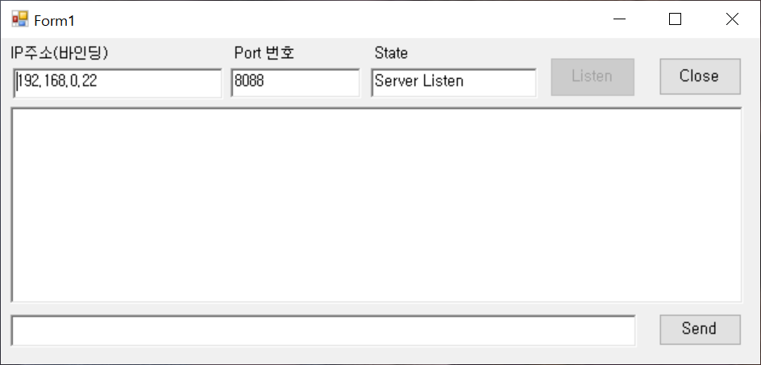
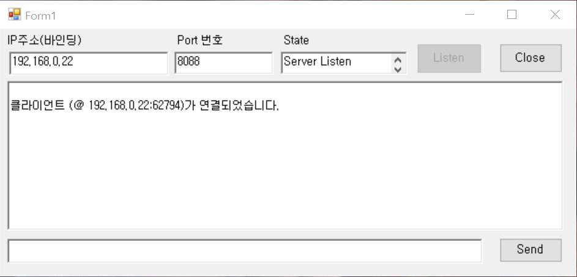
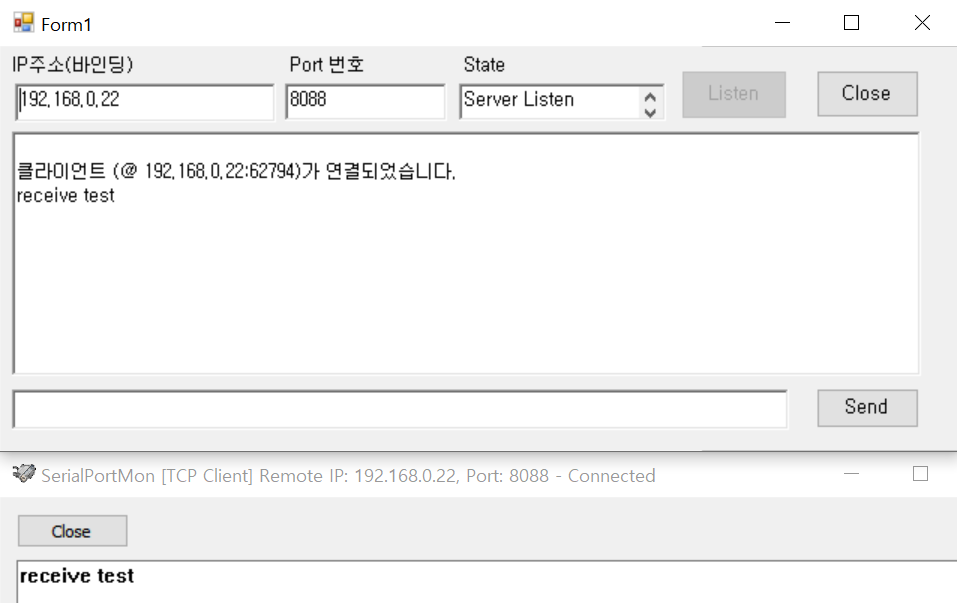
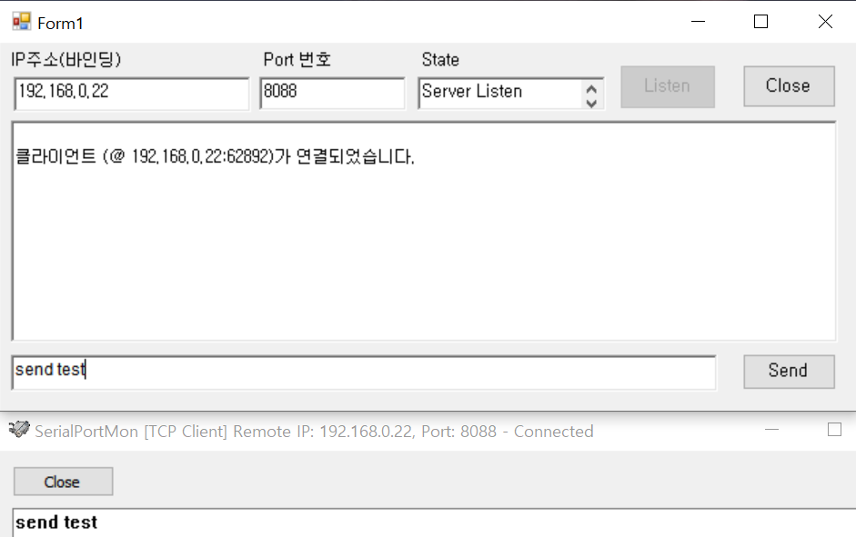

# TcpServer
vs의 winform c#을 이용하여 tcp통신의 서버를 만들었다.  

## 기능
1. ip주소 창에 연결된 ip주소를 나타냄
2. 디폴트 포트번호는 8088이며 수정 가능
3. state에는 현재 연결 상태를 나타냄  
4. 클라이언트 연결되면 textbox에 알림 문구 뜸
5. 수신되는 값이 textbox에 나타남  
6. 송신데이터 입력 후 Send 버튼 클릭 시 클라이언트에 데이터 전송  
  

